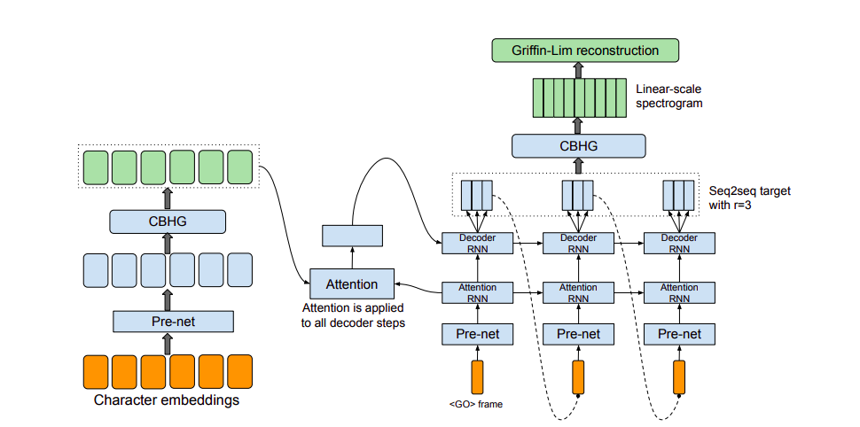
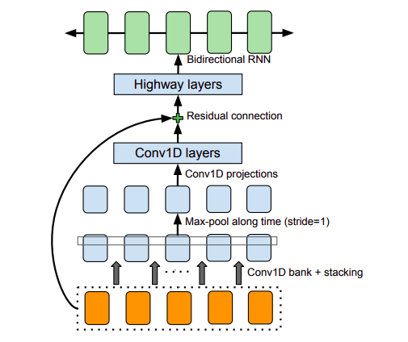

# TACOTRON (March 2017)

## Original paper: https://arxiv.org/pdf/1703.10135.pdf

## 1. Tổng quan.

Xây dựng một hệ thống tổng hợp tiếng nói (TTS) chuyên dụng bao gồm nhiều stages, như là tiền xử lý, phân tích văn bản, mô hình ngữ âm học, mô đun tổng hợp lên âm thanh. Xây dựng những thành phần này thường yêu cầu nền tảng kinh nghiệm chuyên sâu. Trong paper này, tác giả giới thiệu Tacotron, một end-to-end generative text-to-speech model tổng hợp tiếng nói trực tiếp từ ký tự. Khi có cặp <text, audio>, mô hình có thể huấn luyện hoàn chỉnh from scratch với khởi đầu random. Tác giả giới thiệu một số kỹ thuật chính để tạo nên một framework Seq2Seq hoạt động hiệu quả với challenging task này. Tacotron đạt được 3.82/5 MOS trên tiếng Anh (US English), vượt trội hơn hẳn so với một hệ thống production parametric về độ tự nhiên của giọng. Hơn nữa, vì Tacotron tạo ra giọng nói ở frame-level, nó nhanh hơn đáng kể so với sample-level của phương pháp autoregressive.

Modern TTS pipelines rất phức tạp (Taylor, 2009). Ví dụ, thông thường tham số thống kê của TTS có trước khi văn bản trích xuất các features ngôn ngữ học khác nhau, mô hình duration, mô hình dự đoán tính năng âm thanh và một bộ phát âm dựa trên xử lý tín hiệu phức tạp (Zen
et al., 2009; Agiomyrgiannakis, 2015). Các thành phần này dựa trên kinh nghiệm chuyên sâu và rất khó để thiết kế. Họ cũng huấn luyện các thành phần riêng biệt, vậy nên lỗi xảy ra ở mỗi thành phần có thể tạo ra lỗi lớn. 
Do đó, sự phức tạp của các thiết kế TTS hiện đại dẫn đến những nỗ lực kỹ thuật đáng kể khi xây dựng một hệ thống mới.

Có rất nhiều lợi thế của hệ thống TTS end2end tích hợp, hệ thống này có thể được huấn luyện bằng cặp <text, audio> với sự góp mặt ít nhất bởi con người. Đầu tiên, một hệ thống như vậy làm giảm yêu cầu về kỹ thuật tính năng tốn kém mà có thể liên quan đến heuristics và brittle design choices. Thứ hai, nó dễ dàng điều chỉnh các thuộc tính khác nhau chẳng hạn như speaker, ngôn ngữ hoặc các feature cấp cao như sentiment.

Điều này bởi vì việc điều chỉnh (conditioning) có thể xảy ra ngay từ đầu của mô hình chứ không chỉ trên một số thành phần nhất định. Tương tự, việc thích ứng với dữ liệu mới cũng có thể dễ dàng hơn. Cuối cùng, một mô hình duy nhất có khả năng robust mạnh hơn là mô hình nhiều tầng, ngoài ra mô hình nhiều tầng còn bị gộp errors thành phần tạo thành một big error. Những lợi thế này ngụ ý rằng một mô hình đầu cuối có thể cho phép chúng ta đào tạo trên một lượng lớn dữ liệu phong phú, gồm cả biểu cảm và tiếng ồn trong thế giới thực.

TTS thường được coi là large-scale inverse problem (vấn đề nghịch đảo quy mô lớn): Một nguồn nén cao (văn bản) được "giải nén" thành âm thanh. Vì một văn bản có thể tương ứng với các cách phát âm hoặc cách nói khác nhau, đây là một nhiệm vụ rất khó khăn cho một mô hình end-to-end. Mô hình này phải đối phó với các biến thể lớn ở mức tín hiệu cho một đầu vào nhất định.
Hơn nữa, không giống như end-to-end nhận dạng tiếng nói hay dịch máy, output của TTS liên tục và thường dài hơn input. Các thuộc tính này gây ra lỗi dự đoán để tích lũy nhanh chóng. Trong paper này, chúng tôi đề xuất Tacotron, một mô hình generative TTS end-to-end dựa trên seq-to-seq với attention paradigm. Mô hình của chúng tôi nhận kí tự làm đầu vào và đầu ra là raw spectrogram, sử dụng một số kỹ thuật để cải thiện khả năng của mô hình vanilla seq2seq. Với cặp <text, audio>, Tacotron có thể được huấn luyện từ đầu với sự khởi tạo ngẫu nhiên. Nó không yêu cầu phoneme-level alignment, do đó nó có thể dễ dàng mở rộng quy mô để sử dụng một lượng lớn dữ liệu âm thanh với scripts. Với một kỹ thuật tổng hợp waveform đơn giản, Tacotron nhận được 3.82 điểm MOS trên ngôn ngữ tiếng Anh, vượt trội so với các hệ thống trước đây.

Figure 1: Kiến trúc mô hình. Mô hình nhận kí tự làm input và output là quang phổ tương ứng, sau đó được đưa qua thuật toán tái cấu trúc Griffin-Lim để tổng hợp thành tiếng nói.

## 2. Related Work.

Wavenet là một mô hình generative hiệu quả đối với audio. Nó cũng hoạt động tốt cho TTS, tuy nhiên nó chậm do sample-level autoregressive nature. Nó cũng yêu cầu điều chỉnh các tính năng ngôn ngữ từ phần TTS frontend đã có, do vậy không phải là mô hình end-to-end, nó chỉ thay thế vocoder và mô hình ngữ âm. Một mô hình thần kinh khác được thiết kế gần đây là DeepVoice (2017), đã thay thế mọi thành phần trong pipeline TTS điển hình bằng mạng thần kinh tương ứng. Tuy nhiên, mỗi thành phần lại phải huấn luyện độc lập, và nó không cần thiết phải thay đổi hệ thống để đào tạo theo kiểu end-to-end.

Theo hiểu biết của tác giả, (Wang) et al., 2016) đã nghiên cứu sớm nhất về việc xây dựng mô hình end-to-end TTS sử dụng seq2seq cùng voiwss attention. Tuy nhiên, nó đòi hỏi một mô hình Markov ẩn (HMM) được huấn luyện từ trước để giúp mô hình seq2seq học được sự liên kết (alignment). Đầu tiên, khó có thể biết được bao nhiêu alignment được học bởi seq2seq mỗi giây. Thứ hai, một vài tricks được dùng để lấy ra được một mô hình đã được huấn luyện, which the authors note hurts prosody. Thứ ba, nó dự đoán các tham số của vocoder, do vậy cần một bộ phát âm (vocoder). Hơn nữa, mô hình được huấn luyện trên đầu vào là đơn âm (phoneme) và kết quả thực nghiệm có phần bị hạn chế. 

Char2Wav (Sotelo et al., 2017) là một mô hình end-to-end được thiết kế độc lập, có thể huấn luyện trên kí tự. Tuy nhiên, Char2Wav vẫn dự đoán tham số vocoder trước khi sử dụng SmapleRNN neural vocoder, trong khi Tacotron trực tiếp dự đoán raw spectrogram. Vì thế, seq2seq của họ và những mô hình SampleRNN cần được huấn luyện riêng trước, nhưng mô hình của tác gì có thể huấn luyện từ đầu luôn. Cuối cùng, tác giả áp dụng một số sửa đổi quan trọng đối với mô hình vanilla seq2seq. Như bên dưới, một mô hình seq2seq vanilla sẽ không hoạt động tốt đối với đầu vào ở mức kí tự.

## 3. Kiến trúc mô hình

Phần chính của Tacotron là một mô hình seq2seq với attention. Hình 1 bên trên miêu tả mô hình, bao gồm một encoder, một decoder dựa trê attention và một mạng post-processing. Ở mức cao, mô hình nhận kí tự làm đầu vào và tạo ra khung spectrogram và sau đó chuyển thành dạng sóng. Các thành phần được đề cập như hình dưới.

Figure 2: The CBHG (1-D convolution bank + highway network + bidirectional GRU) module
adapted from Lee et al. (2016).

### 3.1. CBHG Module

Trước tiên chúng tôi mô tả một khối xây dựng có tên là CBHG, được minh họa trong Hình 2. CBHG bao gồm một băng gồm các bộ lọc tích chập 1-D, lấy cảm hứng từ highway networks và một Bidirectional RNN (bidirectional gated recurrent unit recurrent neural net). CBHG là một module hiệu quả để trích xuất các biểu diễn từ các chuỗi.