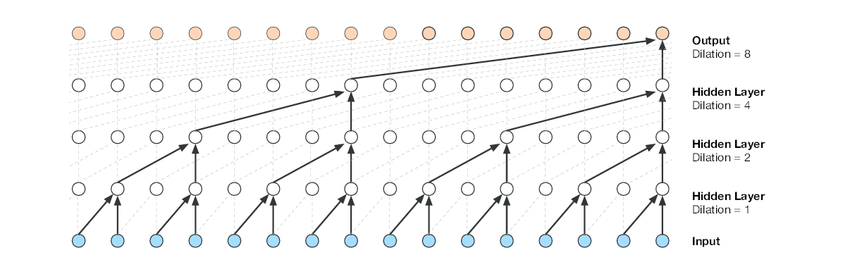

# Paper WaveNet

## Original paper: https://arxiv.org/pdf/1609.03499.pdf

## Tổng quan 
Paper giới thiệu WaveNet, một mạng thần kinh sâu để tạo ra âm thanh dạng sóng thô. WaveNet là mô hình phân bố xác suất đầy đủ và autoregressive.
Phân phối dự đoán cho từng mẫu âm thanh được điều chỉnh dựa trên tất cả các mẫu âm thanh trước nó.
Tuy nhiên, WaveNet đạt hiệu quả trong việc training với dữ liệu âm thanh hàng chục nghìn sample/s.

Khi được sử dụng trong tổng hợp tiếng nói, WaveNet đang cho chất lượng tốt nhất. Người nghe nhận xét âm thanh tự nhiên hơn rất nhiều các phương pháp khác trong cả tiếng Anh lẫn
tiếng Trung.
Một mạng WaveNet duy nhất có thể nắm bắt được các đặc điểm của nhiều người nói khác nhau với độ trung thực như nhau. 
Khi được đào tạo để mô hình hóa âm nhạc, Wavenet cho ra những đoạn nhạc mới lạ và có tính thực tế cao.

## 1.Giới thiệu

Paper này khám phá các kỹ thuật tạo ra âm thanh thô, lấy cảm hứng từ những tiến bộ gần đây trong các mô hình autoregressive generative mô hình hóa các phân phối phức tạp như hình ảnh,
văn bản. Mô hình xác suất chung qua pixels hoặc words bằng cách sử dụng neural architectures là sản phẩm của phân phối có điều kiện và mang lại state-of-the-art generation.

Đáng chú ý, các kiến trúc này có thể mô hình phân phối qua hàng ngàn biến ngẫu nhiên (ví dụ: 64 × 64 pixel như 
trong PixelRNN). Câu hỏi mà paper này giải quyết là liệu các phương pháp tương tự có thể thành công
trong việc tạo ra các dạng sóng âm thanh thô băng rộng hay không khi tín hiệu có độ phân giải thời gian rất cao, 
ít nhất 16.000 mẫu mỗi giây.

Paper này giới thiệu về WaveNet, mô hình tạo ra audio dựa vào kiến trúc của PixelCNN. Những nội dung chính của công trình này
như sau:

  * Chúng tôi cho thấy rằng WaveNets có thể tạo tín hiệu giọng nói thô với sự tự nhiên tốt nhất trong lĩnh vực chuyển văn bản thành giọng nói (TTS), được đánh giá bởi những người đánh giá con người.
  * Để đối phó với sự phụ thuộc thời gian dài cần thiết cho việc tạo âm thanh thô, chúng tôi phát triển các kiến 
  trúc mới dựa trên dilated causal convolutions, đạt được trường tiếp nhận lớn hơn với ít tham số hơn và ít lớp hơn.
  * Chúng tôi thấy rằng khi được điều chỉnh trên một danh tính người nói, một mô hình duy nhất có thể được sử dụng để tạo ra các giọng nói khác nhau.
  * Kiến trúc tương tự cho thấy kết quả tốt khi được thử nghiệm trên một tập dữ liệu nhận dạng giọng nói nhỏ và hứa hẹn khi được sử dụng để tạo các chế độ âm thanh khác như âm nhạc.
Chúng tôi tin rằng WaveNets cung cấp một bộ khung chung và linh hoạt để giải quyết nhiều ứng dụng dựa trên việc tạo âm thanh (ví dụ: TTS, âm nhạc, tăng cường giọng nói, chuyển đổi giọng nói, tách nguồn).

## 2.WaveNet

Xác suất chung của dạng sóng x = {x1 ,. . . , xT} được coi là một sản phẩm của xác suất có điều kiện như sau:

 
 
 Do đó, mỗi mẫu âm thanh x(t) được điều chỉnh trên các mẫu tại tất cả các dấu thời gian trước đó.
 Tương tự như PixelCNNs, phân phối xác suất có điều kiện được mô hình hóa bằng stack các lớp tích chập.
 Không có layer pooling trong mạng này, ouput của model sẽ có cùng chiều thời gian so với input.
 Mô hình đưa ra phân phối phân loại theo giá trị x(t) tiếp theo với layer softmax và nó được tối ưu để tối đa hóa 
 log likelihood của dữ liệu w.r.t. những thông số. Vì log likelihood có thể dễ dàng điều chỉnh, chúng tôi điều 
 chỉnh hyperparameters trên validation set và có thể dễ dàng đo lường nếu mô hình bị overfitting hoặc underfitting.
 
 ### 2.1.DILATED CAUSAL CONVOLUTIONS
 
  
  
 Điểm chính trong WaveNet là Causal convolutions. Bằng cách sử dụng causal convolutions, chúng ta có thể
 chắc chắn rằng model sẽ không vi phạm thứ tự khi chúng ta mô hình hóa dữ liệu: Dự đoán p(xt+1 | x1, ..., xt) sẽ không 
 phụ thuộc vào những timesteps xt+1, xt+2,... trong tương lai.
 Với hình ảnh, tương tự causal convolution là masked convolution, được thực hiện bằng cách xây dựng một mask tensor và nhân
 nó với convolution kernel trước khi áp dụng. Với data 1-D như âm thanh, có thể dễ dàng thực hiện điều này bằng cách thay
 đổi đầu ra của convolution thông thường theo một vài timesteps.
 
 Chi tiết hơn về việc sử dụng dilated convolutions và 1-D causal trong Wavenet có thể xem ở đây: [Convolutions in Autoregressive Neural Networks](https://theblog.github.io/post/convolution-in-autoregressive-neural-networks/)

Trong lúc training, các dự đoán có điều kiện của tất cả timesteps có thể được thực hiện song song bởi tất cả timesteps của groud truth x đều đã biết. Khi generating với mô hình, các dự đoán là tuần tự (sequential): Sau mỗi sample được dự đoán, nó sẽ được đưa trở lại mạng để dự đoán sample tiếp theo. Bới vì mô hình với causal convolutions không có recurrent connections, nên việc đào tạo thường nhanh hơn RNNs, đặc biệt khi áp dụng với những chuỗi dài. Một vấn đề của causal convolutions đó là nó yêu cầu rất nhiều lớp (layers), hoặc filters rất lớn để tăng trường tiếp nhận (receptive field). 

Ví dụ trong hình trên, receptive field chỉ có 5. Trong paper này chúng ta sử dụng dilated convolutions để tăng số lượng receptive field theo cường độ (magnitude) mà không làm tăng đáng kể chi phí tính toán.

Một mạng tích chập giãn (dilated convolution) (còn được gọi là trous hay convolution with holes) là một tích chập trong đó filter được áp dụng trên một diện tích lớn hơn chiều dài của nó bằng cách bỏ qua giá trị đầu vào với một số bước nhất định.
Nó tương đương với convolution có filter lớn và được làm giãn ra với các số 0, tuy nhiên hiệu quả hơn đáng kể. Một dilated convolution hiệu quả cho phép mạng hoạt động trên quy mô thô (coarser) hơn so với convolution thông thường. Tương tự pooling hay strided convolution tuy nhiên ở đây output và input có cùng size. Trong trường hợp đặc biệt, dilated convolution với dilation=1 tạo ra 1 convolution chuẩn. Hình bên dưới mô tả dilated causal convolutions với dilation=1, 2, 4, 8. Dilated convolutions trước đây đã được sử dụng nhiều trong các lĩnh vực khác nhau: xử lý tín hiệu, image segmentation.

Stacked dilated convolutions cho phép các mạng có được receptive fields rất lớn chỉ với một vài layers, trong khi vẫn giữ được độ phân giải của input trên toàn mạng cũng như hiệu quả tính toán tốt. Trong paper này, dilation được nhân đoi cho mỗi layer, lên đến giới hạn sau đó lặp lại, ví dụ: 1, 2, 4, .., 512, 1, 2, 4, .., 512, ... Intuition đằng sau cấu hình này là two-fold. Đầu tiên, tăng theo cấp số nhân hệ số delation và receptive field tăng theo cấp số nhân theo chiều sâu. Ví dụ: mỗi 1, 2, 4,..., 512 khối có receptive field kích thước 1024. Sau đó xếp chồng các khối này làm tăng khả năng mô hình và kích thước receptive field. 

 ### 2.2.SOFTMAX DISTRIBUTIONS
 
 Một cách tiếp cận để mô hình hóa phân phối có điều kiện p(xt | x1, ..., xt-1) trên các mẫu âm thanh riêng lẻ là sử dụng mô hình hỗn hợp (mixture model) như mạng mật độ hỗn hợp (mixture density network) hoặc mixture of conditional Gaussian scale mixtures (MCGSM). Tuy nhiên, Van den Oord et al.(2016a) đã chỉ ra rằng phân phối softmax có xu hướng hoạt động tốt hơn, ngay cả khi dữ liệu hoàn toàn liên tục (như trường hợp cường độ pixel ảnh hoặc giá trị các mẫu âm thanh). Một trong những lý do là phân phối phân loại (categorical distribution) linh hoạt hơn và dễ dàng mô hình hóa các phân phối tùy chỉnh hơn bởi vì nó không có giả định nào về shape cả.
 
 Vì âm thanh raw thường được lưu dưới dạng một chuỗi các giá trị nguyên 16 bit (mỗi timestep), một lớp softmax sẽ cần đến 16^4=65536 xác suất trên mỗi timestep để mô hình hóa tất cả các giá trị có thể. Để làm điều này trở nên dễ hiểu hơn, đầu tiên chúng ta áp dụng một phép biến đổi theo luật u (luật u là một thuật toán nén-giãn tín hiệu tiêu chuẩn được sử dụng trong các hệ thống viễn thông số nhằm tối ưu hóa hệ thống, ví dụ như giảm dải động của một tín hiệu tương tự để lượng tử hóa và mã hóa nhị phân tín hiệu đó rồi truyền đi) cho dữ liệu, sau đó chuyển nó về 256 giá trị khả dĩ:

Trong đó -1 < xt < 1 và µ = 255. Lượng tử hóa phi tuyến tính này tạo ra một sự tái cấu trúc tốt hơn đáng kể so với sơ đồ lượng tử hóa tuyến tính đơn giản. Đặc biệt đối với lời nói, chúng tôi thấy rằng tín hiệu được tái tạo sau khi lượng tử hóa nghe rất giống với bản gốc.

 ### 2.3.GATED ACTIVATION UNITS
 
 Paper sử dụng gated activation unit giống như của PixelCNN:
  
     (2)
  
 trong đó * biểu thị tích chập, (·) là nhân 2 ma trận, σ(·) là sigmoid function, k là index layer, f và g biểu thị filter và gate, W là một convolution filter có thể học được. Trong việc mô hình hóa tín hiệu âm thanh, hàm phi tuyến hoạt động tốt hơn đáng kể so với linear activation function được sửa đổi.
 
 ### 2.4 RESIDUAL AND SKIP CONNECTIONS
 
  
  
  Cả residual và parameterised skip connections đều được sử dụng trên toàn mạng, để tăng tốc độ hội tụ và cho phép đào tạo các mô hình sâu hơn. Trong hình trên hiển thị một khối residual của mô hình, được xếp chồng lên nhau nhiều lần trong mạng.
  
 ### 2.5 CONDITIONAL WAVENETS
 
 Given an additional input h, WaveNets can model the conditional distribution p (x | h) of the audio
given this input. Eq. (1) now becomes:

By conditioning the model on other input variables, we can guide WaveNet’s generation to produce
audio with the required characteristics. For example, in a multi-speaker setting we can choose the
speaker by feeding the speaker identity to the model as an extra input. Similarly, for TTS we need
to feed information about the text as an extra input.

We condition the model on other inputs in two different ways: global conditioning and local conditioning. Global conditioning is characterised by a single latent representation h that influences the
output distribution across all timesteps, e.g. a speaker embedding in a TTS model. The activation
function from Eq. (2) now becomes:

where V∗,k is a learnable linear projection, and the vector VT∗,kh is broadcast over the time dimension.
For local conditioning we have a second timeseries ht, possibly with a lower sampling frequency
than the audio signal, e.g. linguistic features in a TTS model. We first transform this time series
using a transposed convolutional network (learned upsampling) that maps it to a new time series
y = f(h) with the same resolution as the audio signal, which is then used in the activation unit as
follows:

where Vf,k ∗y is now a 1×1 convolution. As an alternative to the transposed convolutional network,
it is also possible to use Vf,k ∗h and repeat these values across time. We saw that this worked slightly
worse in our experiments.

### 2.6 CONTEXT STACKS

We have already mentioned several different ways to increase the receptive field size of a WaveNet:
increasing the number of dilation stages, using more layers, larger filters, greater dilation factors,
or a combination thereof. A complementary approach is to use a separate, smaller context stack
that processes a long part of the audio signal and locally conditions a larger WaveNet that processes
only a smaller part of the audio signal (cropped at the end). One can use multiple context stacks
with varying lengths and numbers of hidden units. Stacks with larger receptive fields have fewer
units per layer. Context stacks can also have pooling layers to run at a lower frequency. This keeps
the computational requirements at a reasonable level and is consistent with the intuition that less
capacity is required to model temporal correlations at longer timescales.

## 3.EXPERIMENTS

### 3.1 MULTI-SPEAKER SPEECH GENERATION

A single WaveNet was able to model speech from any of the speakers by conditioning it on a onehot encoding of a speaker. This confirms that it is powerful enough to capture the characteristics of
all 109 speakers from the dataset in a single model. We observed that adding speakers resulted in
better validation set performance compared to training solely on a single speaker. This suggests that
WaveNet’s internal representation was shared among multiple speakers.

Finally, we observed that the model also picked up on other characteristics in the audio apart from
the voice itself. For instance, it also mimicked the acoustics and recording quality, as well as the
breathing and mouth movements of the speakers.

### 3.2 TEXT-TO-SPEECH

### 3.3 MUSIC

